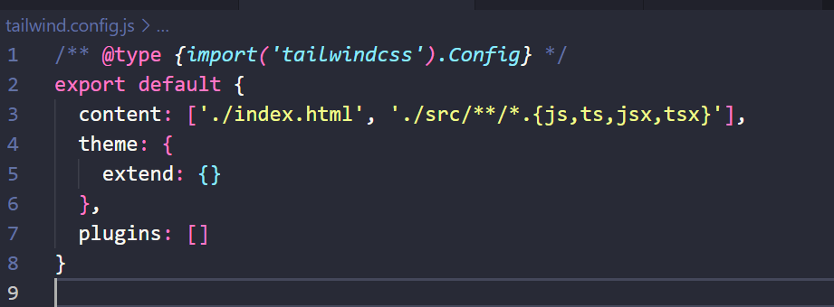

# Documentation for APP frontend PineappleSoccer 2.0

## Technologies and dependencies

- APP written in TypeScript with ReactJS
- Tailwindcss

---

## Step by step

`npm create vite@latest name_project`

- to initialize the **_project_**

`npm install`

- to install dependencies the project

`npm run dev`

- to start project in port

`npm install -D tailwindcss postcss autoprefixer`

- to install tailwindcss

`npx tailwindcss init -p`

- to initialize tailwindcss config

  - next config your tailwindcss.config

  

  - And place these notations at the top of the index.css file
    - @tailwind base;
    - @tailwind components;
    - @tailwind utilities;

`npm install react-icons`

- To use the React icons library

`npm install axios`

- To use the Axios API consumption library
